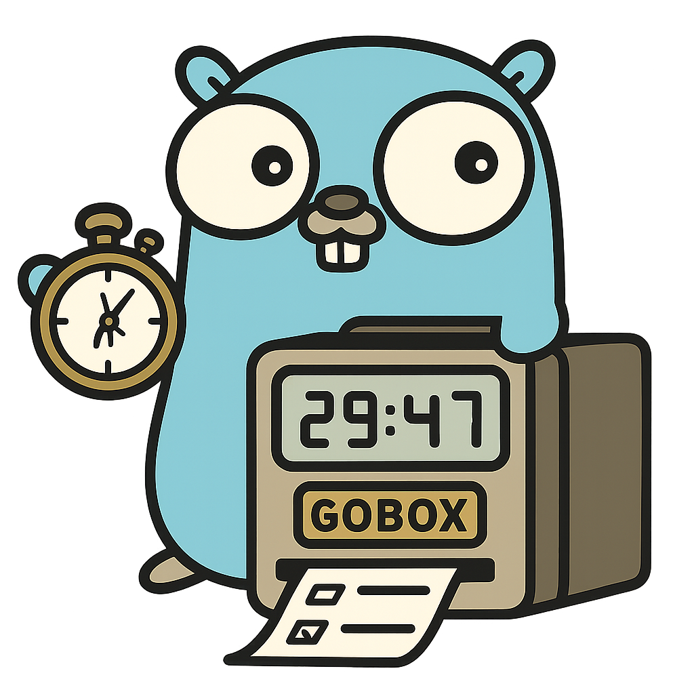
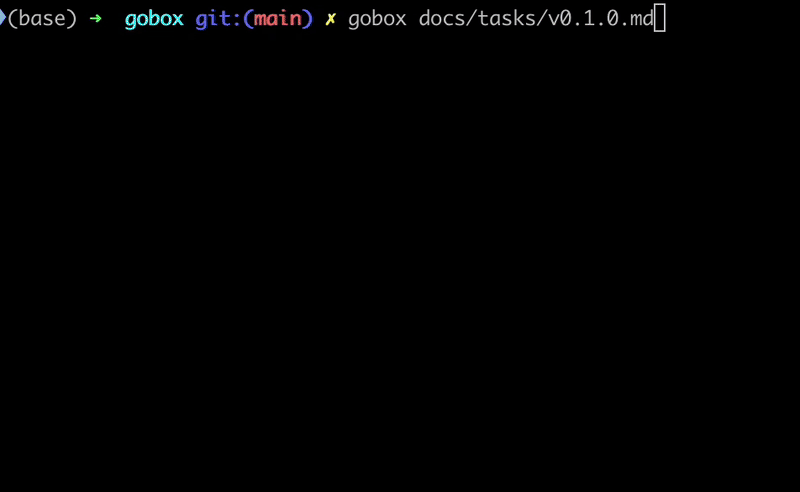

# GoBox: Timeboxing with Git Accountability

## What is GoBox?

GoBox is a simple CLI tool written in Go that supports a basic timeboxing workflow for tasks in Markdown files. It works with your Git repository to log commits made during a work session, helping you review your progress without any fuss.



## ✨ Goals

* **Improve Focus:** Support dedicated work on a single task for a set duration.
* **Track Accountability:** Provide a record of Git commits associated with timeboxed sessions.
* **Manage Scope:** The visibility of commits within a timebox can help in staying focused on the task's defined scope.
* **Integrate Workflow:** Connect task management with existing Markdown notes and Git practices.

## 🌟 High-Level Features

* **Markdown Checklist Parsing:** Reads Markdown files to identify checklist items (`- [ ]` or `- [x]`).
* **Timebox Syntax Recognition:** Interprets timebox definitions per task, such as `@1h30m`.
* **Interactive Timer:** Initiates a timer for the next available task, counting down until completion or user input.
* **Git Integration:** Monitors the local Git repository and displays new commits as they occur during the active timebox.
* **Automated Markdown Update:** Upon task completion, `GoBox` performs the following updates to the Markdown file:
  * Checks the task's box (`- [x]`).
  * Appends a completion timestamp and the actual duration spent.
  * Lists all Git commits made during the timeboxed session directly under the task.


## 🛠️ Installation

Install GoBox using `go install`:

```bash
go install github.com/lohmander/gobox@latest
```

Alternatively, you can build from source:

```bash
git clone https://github.com/lohmander/gobox.git
cd gobox
make build
```

## 🚀 Usage

To run GoBox, just type:

```bash
gobox mytasks.md
```

For more info, check the docs in the `docs/` directory.

## 🛣️ Future Enhancements

Planned enhancements for `GoBox` include:

* Support for time ranges, e.g., `@[11:00-12:30]`
* Enhanced parsing for nested tasks in Markdown.
* Optional audio cues for timer completion.
* Potential macOS status bar integration.
